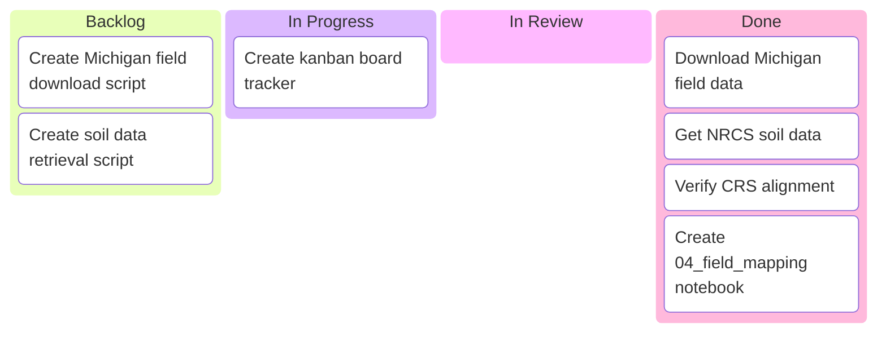

# Assignment 01: Michigan Field Import — Kanban Board

_[Scope: Assignment 01 - Field Mapping]_
_[Student] · Last updated: 2026-03-14]_

---

## 📋 Board Overview

**Period:** 2026-03-14
**Goal:** Import one large Michigan corn belt field and NRCS soil data, verify CRS alignment (EPSG:4326), and create the field mapping notebook
**WIP Limit:** 3

### Visual board

_Kanban board showing current work distribution:_



---

## 🚦 Board Status

| Column             | Count | WIP Limit | Status             |
| ------------------ | ----- | --------- | ------------------ |
| 📋 **Backlog**     | 0     | —         | All complete       |
| 🔄 **In Progress** | 0     | 3         | 🟢 Under limit     |
| 🔍 **In Review**   | 0     | —         | —                  |
| ✅ **Done**        | 4     | —         | All tasks complete |
| 🚫 **Blocked**     | 0     | —         | —                  |
| 🚫 **Won't Do**    | 0     | —         | —                  |

---

## 📋 Backlog

| #   | Item                                  | Priority | Estimate | Notes                        |
| --- | ------------------------------------- | -------- | -------- | ---------------------------- |
| 1   | Create Michigan field download script | 🔴 High  | S        | Use real MI corn belt coords |
| 2   | Create soil data retrieval script     | 🔴 High  | S        | Query NRCS SDA API           |

---

## 🔄 In Progress

| Item                        | Assignee | Started    | Expected   | Days in column | Aging | Status      |
| --------------------------- | -------- | ---------- | ---------- | -------------- | ----- | ----------- |
| Create kanban board tracker | [User]   | 2026-03-14 | 2026-03-14 | 0              | 🟢    | 🟢 On track |

---

## ✅ Done

| Item                       | Assignee | Completed | Cycle time | Notes |
| -------------------------- | -------- | --------- | ---------- | ----- |
| _[No items completed yet]_ |          |           |            |       |

---

## 🚫 Blocked

| Item | Assignee | Blocked since | Blocked by | Escalated to | Unblock action       |
| ---- | -------- | ------------- | ---------- | ------------ | -------------------- |
|      |          |               |            |              | _[No blocked items]_ |

---

## 🚫 Won't Do

| Item | Date decided | Decision owner | Rationale                        | Revisit trigger |
| ---- | ------------ | -------------- | -------------------------------- | --------------- |
|      |              |                | _[No items explicitly declined]_ |                 |

---

## 📊 Metrics

### This period

| Metric                            | Value | Target | Trend |
| --------------------------------- | ----- | ------ | ----- |
| **Throughput** (items completed)  | 0     | 4      | →     |
| **Avg cycle time** (start → done) | N/A   | 1 day  | →     |
| **CRS verification** (EPSG:4326)  | —     | ✅     | —     |

> 💡 **Goal:** Complete all 4 tasks with verified EPSG:4326 CRS alignment

---

## 📝 Board Notes

### Tasks

1. **Download Michigan field** - Use real St. Joseph County, MI coordinates (~41.92°N, 85.58°W)
2. **Get NRCS soil data** - Query USDA NRCS Soil Data Access API
3. **Verify CRS** - Ensure both use EPSG:4326, use .to_crs() if needed
4. **Create notebook** - Build notebooks/04_field_mapping.ipynb

### Data flow

```
Michigan Corn Belt (St. Joseph County)
    ↓
download_michigan_field.py → michigan_field.geojson (EPSG:4326)
    ↓
get_soil_for_field.py → NRCS SDA API → michigan_soil.csv
    ↓
notebooks/04_field_mapping.ipynb → Load → Verify CRS → Visualize
```

---

## 🔗 References

- NRCS Soil Data Access API: https://sdmdataaccess.sc.egov.usda.gov/
- USDA NASS Crop Sequence Boundaries: https://www.nass.usda.gov/Research_and_Science/Crop-Sequence-Boundaries/
- Michigan corn belt region: St. Joseph County (FIPS: 26)

---

_Next update: After each task completion_
