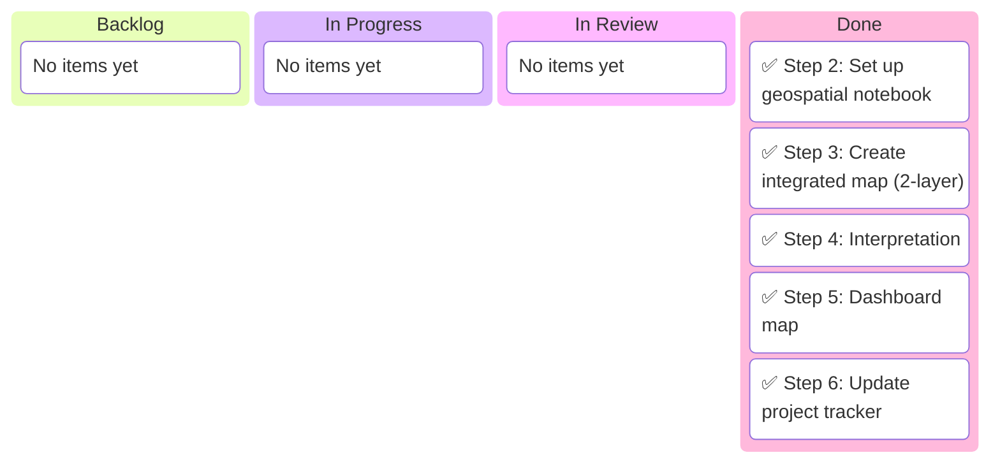

# Assignment 04: Field Mapping — Kanban Board

_Assignment: Geospatial Analysis with SSURGO Soil Data_
_Last updated: 2026-03-10_

---

## Board Overview

**Assignment:** Step 2-6: Field Mapping Analysis
**Objective:** Load field boundaries, overlay soil data, create dashboard map
**WIP Limit:** 2 items In Progress

### Visual Board

---

## 🚦 Board Status

| Column             | Count | WIP Limit | Status              |
| ------------------ | ----- | --------- | ------------------- |
| 📋 **Backlog**     | 0     | —         | All tasks complete  |
| 🔄 **In Progress** | 0     | 2         | Clear               |
| 🔍 **In Review**   | 0     | —         | —                   |
| ✅ **Done**        | 5     | —         | Assignment complete |
| 🚫 **Blocked**     | 0     | —         | Clear               |
| 🚫 **Won't Do**    | 0     | —         | —                   |

---

## Tasks Completed

| Step   | Task                       | Status  | Notes                               |
| ------ | -------------------------- | ------- | ----------------------------------- |
| Step 2 | Set up geospatial notebook | ✅ Done | Load fields, soil data, check CRS   |
| Step 3 | Create integrated map      | ✅ Done | Fields colored by soil type         |
| Step 4 | Interpretation             | ✅ Done | 5-sentence paragraph on variability |
| Step 5 | Dashboard map              | ✅ Done | Saved to output/dashboard_assets/   |
| Step 6 | Update project tracker     | ✅ Done | This tracker                        |

---

## Field Summary

| Field ID        | County    | Crop     | Soil Type | Drainage                | OM (%) | pH  |
| --------------- | --------- | -------- | --------- | ----------------------- | ------ | --- |
| 260910001561001 | Lenawee   | Corn     | Hoytville | Very poorly drained     | 4.5    | 6.7 |
| 261150001561002 | Monroe    | Soybeans | Selfridge | Somewhat poorly drained | 2.6    | 6.3 |
| 261610001561003 | Washtenaw | Corn     | Pella     | Poorly drained          | 5.5    | 7.0 |
| 260690001561004 | Hillsdale | Soybeans | Fox       | Well drained            | 0.25   | 6.8 |
| 260230001561005 | Branch    | Corn     | Fox       | Well drained            | 2.0    | 6.2 |

---

## Data Sources

- **Field Boundaries:** `data/michigan_fields.geojson` (5 fields, EPSG:4326)
- **Soil Data:** `data/michigan_soil_ssurgo.csv` (45 records from NRCS SSURGO)
- **Weather Data:** `data/michigan_weather_2020_2024.csv`

---

## Output Files

| File                                            | Description                              |
| ----------------------------------------------- | ---------------------------------------- |
| `notebooks/04_field_mapping.ipynb`              | Complete Jupyter notebook with all steps |
| `output/dashboard_assets/field_spatial_map.png` | Polished dashboard map                   |

---

## Key Observations

1. **Soil Variability:** Fields show diverse soil types (Fox, Hoytville, Selfridge, Pella)
2. **Drainage Patterns:** Eastern cluster (poorly drained) vs Western (well-drained)
3. **Organic Matter:** Higher in poorly drained soils (2.6-5.5%), lower in well-drained (0.25-2.0%)
4. **Crop-Soil Correlation:** Corn on poorly drained soils; soybeans on well-drained Fox soil

---

## Notes

- Field polygons are small (~0.005° wide) requiring zoomed visualization
- Soil data downloaded via NRCS Soil Data Access REST API
- CRS alignment verified: EPSG:4326 (WGS84)
