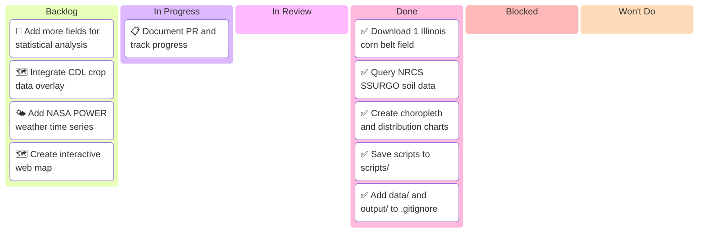

# Sprint W09 2026 — Agricultural Data Analysis

_Sprint W09: Mar 16-22, 2026 · agent-project_
_Last updated: 2026-03-16_

---

## 📋 Board Overview

**Period:** 2026-03-16 → 2026-03-22
**Goal:** Complete initial SSURGO soil analysis for Illinois Corn Belt field and establish data pipeline scripts
**WIP Limit:** 2 items In Progress

### Visual board

_Kanban board showing agricultural data analysis work:_

> ⚠️ **Always show all 6 columns** — Even if a column has no items, include it with a placeholder.

---

## 🚦 Board Status

| Column             | Count | WIP Limit | Status                       |
| ------------------ | ----- | --------- | ---------------------------- |
| 📋 **Backlog**     | 4     | —         | Future enhancements          |
| 🔄 **In Progress** | 1     | 2         | 🟢 Under limit — documenting |
| 🔍 **In Review**   | 0     | —         | —                            |
| ✅ **Done**        | 5     | —         | Initial analysis complete    |
| 🚫 **Blocked**     | 0     | —         | Clear                        |
| 🚫 **Won't Do**    | 0     | —         | —                            |

---

## 🧭 Execution Map

_Execution flow for W09 agricultural data analysis:_

---

## 📊 Work Items

### 📋 Backlog

| ID    | Item                                             | Priority | Notes                         |
| ----- | ------------------------------------------------ | -------- | ----------------------------- |
| W09-1 | Add more fields (10-50) for statistical analysis | Medium   | Current: 1 field only         |
| W09-2 | Integrate CDL crop data overlay                  | Medium   | Use cdl-cropland skill        |
| W09-3 | Add NASA POWER weather time series               | Medium   | Use nasa-power-weather skill  |
| W09-4 | Create interactive web map                       | Low      | Use interactive-web-map skill |

### 🔄 In Progress

| ID    | Item                           | Priority | Notes                       |
| ----- | ------------------------------ | -------- | --------------------------- |
| W09-5 | Document PR and track progress | High     | PR #2 created, kanban board |

### ✅ Done

| ID     | Item                                      | Priority | Notes                            |
| ------ | ----------------------------------------- | -------- | -------------------------------- |
| W09-6  | Download 1 Illinois corn belt field       | High     | data/field_illinois_corn.geojson |
| W09-7  | Query NRCS SSURGO soil data               | High     | 3 soil records retrieved         |
| W09-8  | Create choropleth and distribution charts | High     | 4 PNG files in output/           |
| W09-9  | Save scripts to scripts/                  | High     | 3 Python scripts created         |
| W09-10 | Add data/ and output/ to .gitignore       | High     | Prevents binary bloat            |

---

## 📈 Metrics

### Sprint Velocity

| Metric            | Value | Notes                 |
| ----------------- | ----- | --------------------- |
| Items completed   | 5     | Initial analysis work |
| Items in progress | 1     | Documentation         |
| Backlog size      | 4     | Future enhancements   |

### Flow Efficiency

| Metric              | Value | Target | Status |
| ------------------- | ----- | ------ | ------ |
| WIP                 | 1     | ≤2     | ✅     |
| Blocked items       | 0     | 0      | ✅     |
| Items moved to Done | 5     | —      | ✅     |

---

## 🔗 Links

- [PR #2: Illinois Corn Belt SSURGO Analysis](../pr/pr-00000002-illinois-corn-belt-ssurgo-analysis.md)
- [SSURGO Soil Skill](../../.opencode/skills/ssurgo-soil/SKILL.md)
- [Field Boundaries Skill](../../.opencode/skills/field-boundaries/SKILL.md)
- [EDA Visualize Skill](../../.opencode/skills/eda-visualize/SKILL.md)

---

## 📝 Notes

- Initial analysis complete with 1 field from Illinois Corn Belt
- Soil data successfully retrieved from NRCS Soil Data Access API
- Scripts saved to `scripts/` for reproducibility
- Data and output directories gitignored to prevent repo bloat

---

_Last updated: 2026-03-16_
